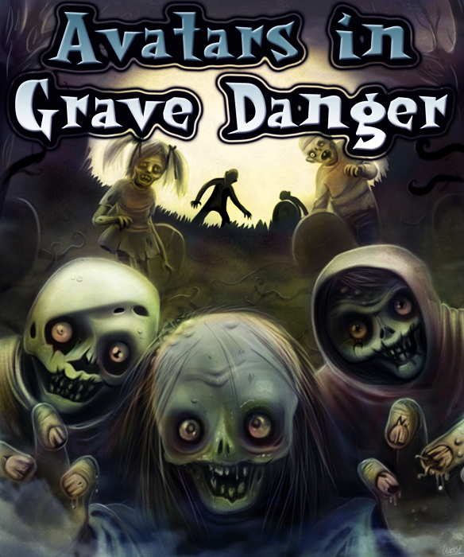
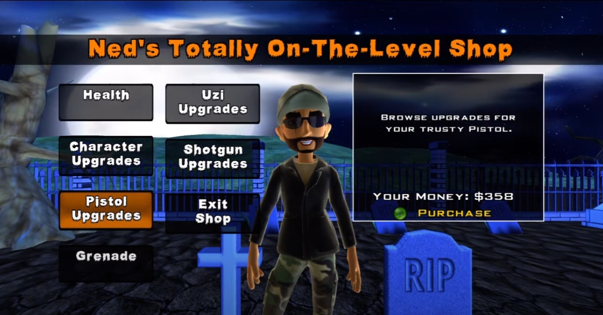

# Avatar In Grave Danger

## Overview

This is a relatively simple game released on the Xbox Live Indie Games marketplace, released in October of 2013.

My primary goal with this project was to learn the XNA Framework and basic principles of game development and design, as well as further my C# knowledge.

In order to complete the project, thousands of lines of code were written. A lot of this code went into the Engine itself, which was built with the help of the XNA Framework, which provides a layer of abstraction for things such as rendering, player input, physics, and more. I also had to do some of the asset creation myself, as well as modify most assets I purchased / licensed.

## Game Description (as presented on Xbox Live)

Zombiefied Avatars are on the loose, and they're hungry -- for fun! Defeat wave after wave of quirky zombies in this light-hearted wave defense game. Blast away 5 types of enemies using an upgradeable arsenal. Slow down time. Unlock over 50 Awards. Share your high scores and challenge your friends. Will you triumph over all 20 waves? (Hint: Probably not!)

**Chatpad or Keyboard required.**

## Try the Game?

Unfortunately, Xbox Live Indie Games closed down in October of 2017. I do not believe there is an official means to play this -- or any other -- XBL Indie game.

## Sample Screenshots

## Gameplay Sample

The following Youtube video is an (apparently satisfied) player who chose to record his gameplay. It is not my video, but rather a good representation of how the average player might have approached playing the game for the first time.

